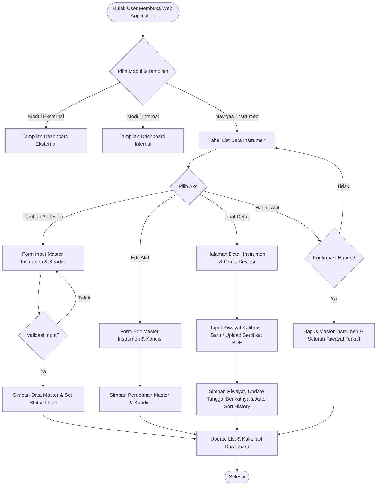
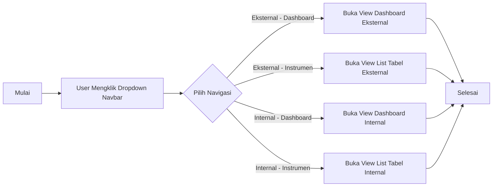
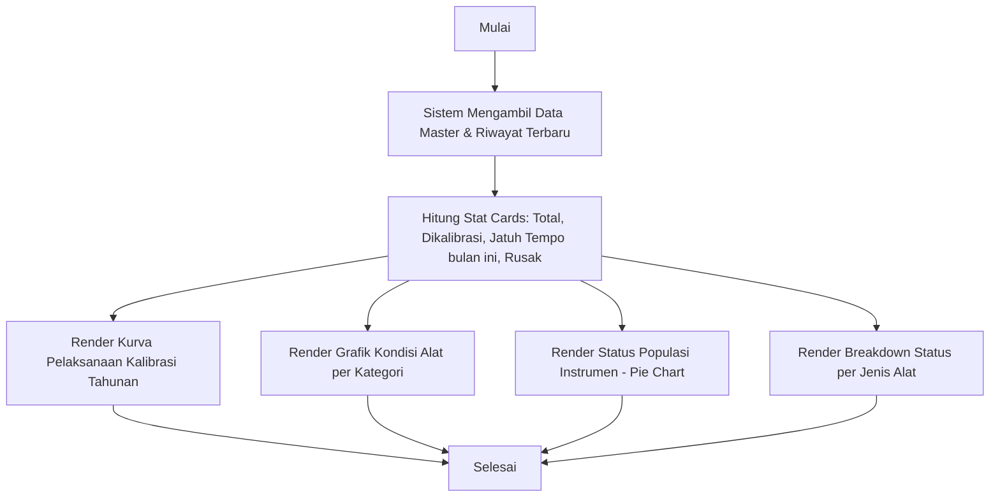
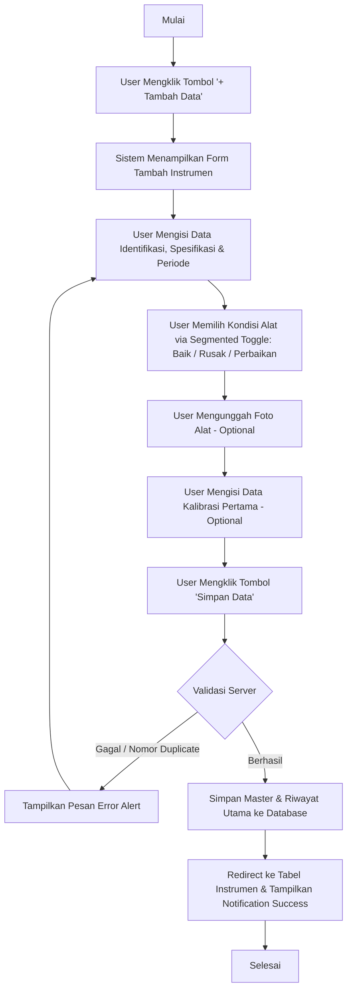
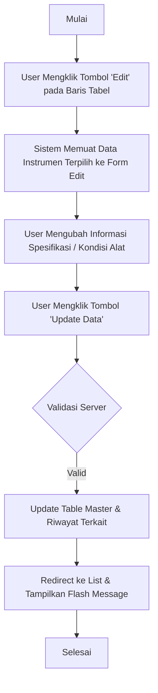
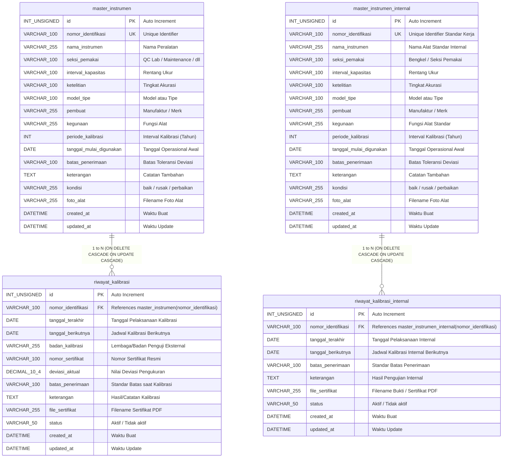

# BLUEPRINT TEKNIS & BUSINESS PROCESS MANAGEMENT (BPM)
## Sistem Manajemen Kalibrasi Instrumen (E-Calibration)
### PT Indonesia Asahan Aluminium (INALUM)

---

## 1. Pendahuluan

Sistem **E-Calibration (Work Schedule & Instrument Monitoring)** adalah sistem informasi yang digunakan untuk mengelola inventaris instrumen pabrik, memantau masa berlaku kalibrasi, mencatat riwayat pelaksanaan kalibrasi (baik oleh badan eksternal maupun internal), serta menyajikan data analisis dalam bentuk dashboard grafik interaktif.

Sistem ini terbagi menjadi 2 modul utama:
1. **Kalibrasi Eksternal**: Pengelolaan instrumen yang proses kalibrasinya dilakukan oleh lembaga/badan kalibrasi luar terakreditasi.
2. **Kalibrasi Internal**: Pengelolaan instrumen standar kerja yang proses kalibrasinya dilakukan secara mandiri oleh tim internal/bengkel kalibrasi INALUM.

---

## 2. General Workflow Sistem E-Calibration



---

## 3. Daftar Tingkat Alur Proses Bisnis (BPM Level List)

Berikut adalah daftar hirarki alur proses bisnis yang siap dieksekusi secara bertahap:

1. **Level 1: Manajemen Navigasi & Pemantauan Dashboard**
   - `3.1` Alur Navigasi Switch Mode (Eksternal vs Internal)
   - `3.2` Alur Pemantauan Dashboard Eksternal (Overview Cards & 4 Grafik Utama)
   - `3.3` Alur Pemantauan Dashboard Internal (Overview Cards & 4 Grafik Utama)

2. **Level 2: Pengelolaan Master Instrumen & Kondisi Alat**
   - `3.4` Alur Tambah Data Master Instrumen Baru (*Add New Instrument*)
   - `3.5` Alur Edit Data Master & Perubahan Kondisi Alat (*Edit Instrument & Condition*)
   - `3.6` Alur Hapus Data Master Instrumen (*Delete Instrument*)

3. **Level 3: Pengelolaan Riwayat Kalibrasi & Sertifikat**
   - `3.7` Alur Pemantauan Halaman Detail & Grafik Deviasi Alat
   - `3.8` Alur Input Riwayat Kalibrasi Baru & Upload Sertifikat PDF (*Add Calibration Record*)
   - `3.9` Alur Hapus Riwayat Kalibrasi Alat

4. **Level 4: Filtering Data & Fitur Operasional**
   - `3.10` Alur Pencarian Live & Filtering Tanggal Kalibrasi (*DataTables Search & Date Range Filter*)

---

## 4. Detail Rincian Alur Proses Bisnis

### 3.1 Alur Navigasi Switch Mode (Eksternal vs Internal)



| Proses | Deskripsi |
| :--- | :--- |
| **Dropdown Navigation** | - User memilih modul **Eksternal** atau **Internal** dari navbar utama.<br>- User memilih tampilan spesifik: **Dashboard** (hanya grafik & statistik) atau **Instrumen** (hanya tabel list data). |
| **Switch View Mode** | - Sistem mengaktifkan section yang dipilih secara dinamis (`#section-dashboard-view` atau `#section-data-view`) tanpa me-reload ulang halaman utama.<br>- URL query parameter disesuaikan (`?tab=dashboard` atau `?tab=data`). |
| **Selesai** | Tampilan diperbarui sesuai preferensi user. |

---

### 3.2 Alur Pemantauan Dashboard Eksternal & Internal



| Proses | Deskripsi |
| :--- | :--- |
| **Overview Cards** | - **Total Instrumen**: Menghitung seluruh unit instrumen terdaftar.<br>- **Dikalibrasi**: Menghitung alat dengan kalibrasi aktif (`tanggal_berikutnya >= hari ini`).<br>- **Jatuh Tempo bulan ini**: Menghitung alat yang jatuh tempo dalam 30 hari ke depan.<br>- **Rusak**: Menghitung alat dengan status kondisi `rusak`. |
| **Kurva Pelaksanaan** | Grafik *line chart* yang membandingkan target kalibrasi per bulan dengan realisasi kalibrasi (*Selesai Dikalibrasi*) pada tahun yang dipilih. |
| **Kondisi per Kategori** | Stacked bar chart yang menampilkan statistik kondisi fisik/operasional alat per kategori (`Baik` 🟢, `Rusak` 🔴, `Perbaikan` 🟡). |
| **Status Populasi (Pie)**| Donut chart yang memvisualisasikan proporsi instrumen (`Dikalibrasi` 🟢, `Akan Expired` 🟡, `Tidak Aktif` 🔴). |
| **Breakdown Jenis Alat**| Stacked horizontal bar chart yang menampilkan rincian status kalibrasi per kategori instrumen (`Dikalibrasi`, `Akan Expired`, `Tidak Aktif`). |

---

### 3.3 Alur Tambah Data Master Instrumen Baru (Add New Instrument)



| Proses | Deskripsi |
| :--- | :--- |
| **Buka Form Tambah** | User mengakses halaman form penambahan instrumen. |
| **Input Identifikasi & Spesifikasi** | User menginput Nomor Identifikasi (unik), Nama Alat, Seksi Pemakai, Kategori, Interval/Kapasitas, Ketelitian, Model/Tipe, Pembuat, Kegunaan, Periode Kalibrasi (tahun), Tanggal Mulai Digunakan, dan Standar Batas. |
| **Select Kondisi Alat** | User memilih kondisi fisik/operasional alat menggunakan **Modern Segmented Toggle**: `🟢 Baik`, `🔴 Rusak`, atau `🟡 Perbaikan`. |
| **Upload Foto & Kalibrasi Awal** | User dapat mengunggah foto fisik alat serta memasukkan tanggal/sertifikat kalibrasi terakhir jika ada. |
| **Simpan & Validasi** | Sistem melakukan verifikasi keunikan `nomor_identifikasi`. Jika valid, data disimpan dan grafik dashboard ter-update otomatis. |

---

### 3.4 Alur Edit Data Master & Kondisi Alat (Edit Instrument)



| Proses | Deskripsi |
| :--- | :--- |
| **Form Edit** | Menampilkan seluruh data aktual instrumen yang dipilih. |
| **Update Kondisi** | User dapat memperbarui status kondisi alat (misalnya dari `Baik` menjadi `Rusak` atau `Perbaikan`). |
| **Simpan Perubahan** | Sistem memperbarui record database dan secara otomatis menyesuaikan statistik pada Dashboard Overview. |

---

### 3.5 Alur Input Riwayat Kalibrasi & Upload Sertifikat PDF

```mermaid
flowchart TD
    A[Mulai] --> B[User Mengklik Tombol 'Detail' (Ikon Mata)]
    B --> C[Sistem Menampilkan Detail Alat, Foto & Riwayat Kalibrasi]
    C --> D[User Mengisi Form 'Tambah Riwayat Kalibrasi']
    D --> E[User Menginput Tanggal Kalibrasi Terakhir & Sertifikat]
    E --> F[User Mengunggah File Sertifikat PDF]
    F --> G[User Mengklik 'Simpan Riwayat']
    G --> H[Sistem Menghitung Tanggal Berikutnya = Tanggal Terakhir + Periode]
    H --> I[Sistem Menilai Riwayat Terbaru Berdasarkan Tanggal Terakhir]
    I --> J[Update Master Record & Simpan File Sertifikat]
    J --> K[Refresh Halaman Detail & Urutkan Tabel Riwayat]
    K --> L[Selesai]
```

| Proses | Deskripsi |
| :--- | :--- |
| **Halaman Detail** | Menampilkan rincian fisik alat, foto, grafik deviasi (jika ada), serta tabel riwayat kalibrasi dari tahun ke tahun. |
| **Input Riwayat Baru** | User menginput tanggal pelaksanaan kalibrasi terbaru, lembaga/badan pengkalibrasi, nomor sertifikat, dan mengunggah sertifikat PDF. |
| **Penentuan Tanggal Berikutnya** | Sistem secara otomatis menghitung `tanggal_berikutnya = tanggal_terakhir + periode_kalibrasi`. |
| **Auto-Sort Riwayat** | Sistem mengurutkan seluruh riwayat secara kronologis. Riwayat dengan tanggal terbaru otomatis diset sebagai **Status Aktif** untuk acuan status instrumen di tabel utama. |

---

## 5. Entity Relationship Diagram (ERD)

Berikut adalah diagram relasi entitas (**Entity Relationship Diagram**) yang dirancang secara presisi sesuai dengan struktur database MySQL/MariaDB yang digunakan saat ini, sehingga memudahkan tim IT INALUM untuk integrasi ke sistem existing:



---

### Spesifikasi Relasi Database:
1. **Relasi Modul Eksternal**:
   - `master_instrumen.nomor_identifikasi` ➔ `riwayat_kalibrasi.nomor_identifikasi`
   - Tipe Relasi: **1 to N (One-to-Many)**. Satu instrumen dapat memiliki banyak catatan riwayat kalibrasi dari tahun ke tahun.
   - Constrain: `ON DELETE CASCADE ON UPDATE CASCADE`. Jika data master dihapus, seluruh riwayat kalibrasinya terhapus secara otomatis secara bersih.

2. **Relasi Modul Internal**:
   - `master_instrumen_internal.nomor_identifikasi` ➔ `riwayat_kalibrasi_internal.nomor_identifikasi`
   - Tipe Relasi: **1 to N (One-to-Many)**.
   - Constrain: `ON DELETE CASCADE ON UPDATE CASCADE`.

---

## 6. Penutup

Dokumen Blueprint Teknis & BPM ini menjadi pedoman operasional lengkap dalam pengembangan, penggunaan, serta integrasi sistem **E-Calibration (PT Indonesia Asahan Aluminium)** ke dalam arsitektur sistem informasi existing INALUM.
