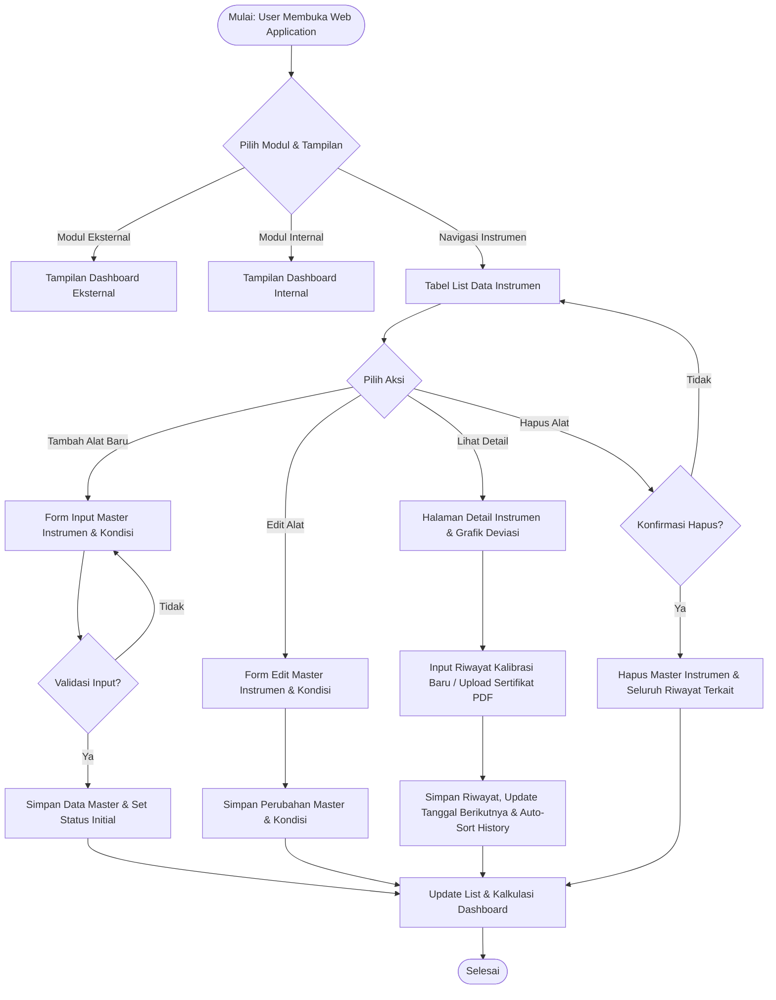
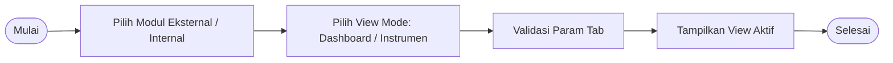
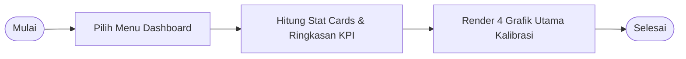
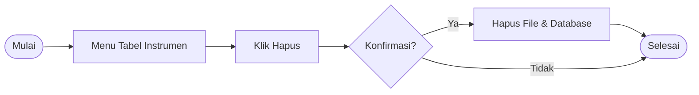
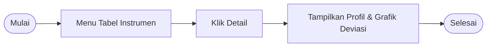
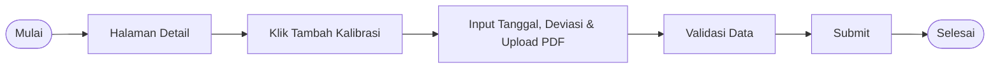
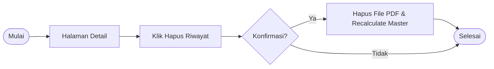
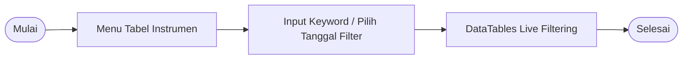
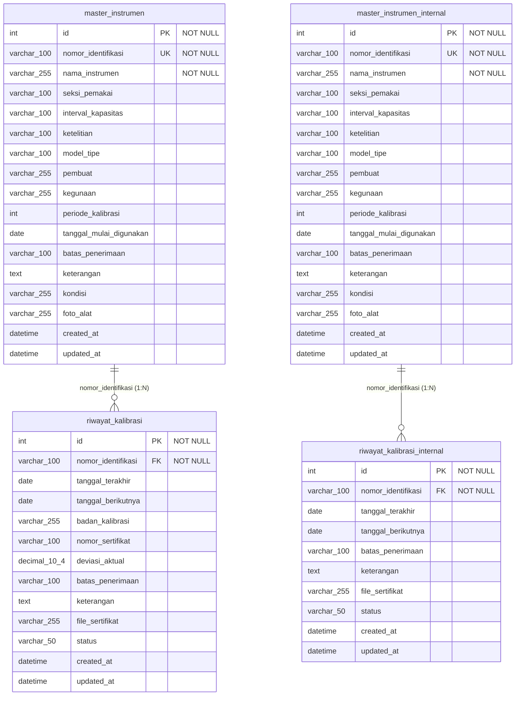

# BLUEPRINT TEKNIS & BUSINESS PROCESS MANAGEMENT (BPM)
## Sistem Manajemen Kalibrasi Instrumen (E-Calibration)
### PT Indonesia Asahan Aluminium (INALUM)

---

## 1. Pendahuluan

Aplikasi Dashboard E-Calibration (Sistem PMN Work Schedule) adalah system yang digunakan untuk penginputan Master Instrumen, jadwal kalibrasi, serta pemantauan progress dan kondisi peralatan yang sedang berlangsung.

Berikut adalah beberapa fitur yang ada dalam aplikasi E-Calibration:
1. **Dashboard Kalibrasi**: berisi grafik dan statistik dari status kalibrasi serta kondisi instrumen (eksternal & internal) yang sedang berlangsung
2. **Submit new instrument**: User menambahkan daftar instrumen baru (eksternal & internal) yang akan dikalibrasi
3. **Update instrument & condition**: User memperbarui spesifikasi teknis dan status kondisi fisik/operasional alat (Baik, Rusak, Perbaikan)
4. **Submit calibration record & certificate**: User mengisi hasil kalibrasi, deviasi pengujian, serta mengunggah file digital sertifikat PDF
5. **Auto calculation & next schedule**: Sistem secara otomatis menghitung tanggal kalibrasi berikutnya dan meng-update status keaktifan alat
6. **Detail & history progress**: User dapat melihat profil instrumen, grafik kurva deviasi pengujian, serta riwayat historis kalibrasi
7. **Live search & date filter**: User dapat melakukan pencarian data secara instan dan menyaring instrumen berdasarkan tanggal kalibrasi

---

## 2. General Workflow Sistem E-Calibration

```mermaid
flowchart TD
    Start([Mulai: User Membuka Web Application]) --> Choice{Pilih Modul & Tampilan}
    
    Choice -->|Modul Eksternal| ExtDash[Tampilan Dashboard Eksternal]
    Choice -->|Modul Internal| IntDash[Tampilan Dashboard Internal]
    
    Choice -->|Navigasi Instrumen| DataView[Tabel List Data Instrumen]
    
    DataView --> ActionChoice{Pilih Aksi}
    
    ActionChoice -->|Tambah Alat Baru| InputMaster[Form Input Master Instrumen & Kondisi]
    InputMaster --> ValidMaster{Validasi Input?}
    ValidMaster -->|Tidak| InputMaster
    ValidMaster -->|Ya| SaveMaster[Simpan Data Master & Set Status Initial]
    SaveMaster --> RefreshData[Update List & Kalkulasi Dashboard]
    
    ActionChoice -->|Edit Alat| EditMaster[Form Edit Master Instrumen & Kondisi]
    EditMaster --> SaveEdit[Simpan Perubahan Master & Kondisi]
    SaveEdit --> RefreshData
    
    ActionChoice -->|Lihat Detail| DetailView[Halaman Detail Instrumen & Grafik Deviasi]
    DetailView --> AddHistory[Input Riwayat Kalibrasi Baru / Upload Sertifikat PDF]
    AddHistory --> SaveHistory[Simpan Riwayat, Update Tanggal Berikutnya & Auto-Sort History]
    SaveHistory --> RefreshData
    
    ActionChoice -->|Hapus Alat| ConfirmDelete{Konfirmasi Hapus?}
    ConfirmDelete -->|Ya| DeleteMaster[Hapus Master Instrumen & Seluruh Riwayat Terkait]
    DeleteMaster --> RefreshData
    ConfirmDelete -->|Tidak| DataView
    
    RefreshData --> Finish([Selesai])
```

---

## 3. Daftar Tingkat Alur Proses Bisnis (BPM Level List)

Berikut adalah daftar hirarki alur proses bisnis yang siap dieksekusi secara bertahap:

1. **Level 1: Manajemen Navigasi & Pemantauan Dashboard**
   - `3.1` Alur Navigasi Switch Mode (Eksternal vs Internal)
   - `3.2` Alur Pemantauan Dashboard (Eksternal & Internal)

2. **Level 2: Pengelolaan Master Instrumen & Kondisi Alat**
   - `3.3` Alur Tambah Data Master Instrumen Baru (*Add New Instrument*)
   - `3.4` Alur Edit Data Master & Perubahan Kondisi Alat (*Edit Instrument & Condition*)
   - `3.5` Alur Hapus Data Master Instrumen (*Delete Instrument*)

3. **Level 3: Pengelolaan Riwayat Kalibrasi & Sertifikat**
   - `3.6` Alur Pemantauan Halaman Detail & Grafik Deviasi Alat
   - `3.7` Alur Input Riwayat Kalibrasi Baru & Upload Sertifikat PDF (*Add Calibration Record*)
   - `3.8` Alur Hapus Riwayat Kalibrasi Alat

4. **Level 4: Filtering Data & Fitur Operasional**
   - `3.9` Alur Pencarian Live & Filtering Tanggal Kalibrasi (*DataTables Search & Date Range Filter*)

---

### 4. Detail Rincian Alur Proses Bisnis

### 3.1 Alur Navigasi Switch Mode (Eksternal vs Internal)

```mermaid
flowchart LR
    A([Mulai]) --> B[Pilih Modul Eksternal / Internal]
    B --> C[Pilih View Mode: Dashboard / Instrumen]
    C --> D[Validasi Param Tab]
    D --> E[Tampilkan View Aktif]
    E --> F([Selesai])
```

| Proses | Deskripsi |
| :--- | :--- |
| **User** | |
| Navigasi Switch Mode | - User memilih modul **Eksternal** atau **Internal** dari navbar utama - User memilih opsi tampilan **Dashboard** atau **Instrumen** - Sistem memvalidasi parameter tampilan pada URL - Sistem menampilkan view aktif secara dinamis - Selesai |

---

### 3.2 Alur Pemantauan Dashboard (Eksternal & Internal)

```mermaid
flowchart LR
    A([Mulai]) --> B[Pilih Menu Dashboard]
    B --> C[Hitung Stat Cards & Ringkasan KPI]
    C --> D[Render 4 Grafik Utama Kalibrasi]
    D --> E([Selesai])
```

| Proses | Deskripsi |
| :--- | :--- |
| **User** | |
| Pemantauan Dashboard | - User mengakses menu Dashboard (Eksternal / Internal) - Sistem menghitung 4 Stat Cards Overview (Total, Dikalibrasi, Jatuh Tempo, Rusak) - Sistem merender Kurva Pelaksanaan Tahunan & Grafik Kondisi per Kategori - Sistem merender Pie Chart Populasi & Breakdown Jenis Alat - Selesai |

---

### 3.3 Alur Tambah Data Master Instrumen Baru

```mermaid
flowchart LR
    A([Mulai]) --> B[Menu Tabel Instrumen] --> C[Klik Tambah Data] --> D[Input Data Master & Kondisi] --> E[Validasi Data] --> F[Submit] --> G([Selesai])
```

| Proses | Deskripsi |
| :--- | :--- |
| **User** | |
| Tambah Master Instrumen | - User memilih menu Tabel Instrumen - User menekan tombol **+ Tambah Data** - User menginput spesifikasi instrumen, memilih kondisi alat, dan upload foto - User melakukan validasi atas data yang diinputkan - User menekan tombol **Submit** untuk menyimpan data - Selesai |

---

### 3.4 Alur Edit Data Master & Perubahan Kondisi Alat

```mermaid
flowchart LR
    A([Mulai]) --> B[Menu Tabel Instrumen] --> C[Pilih Alat & Klik Edit] --> D[Ubah Spesifikasi / Kondisi] --> E[Validasi Data] --> F[Submit] --> G([Selesai])
```

| Proses | Deskripsi |
| :--- | :--- |
| **User** | |
| Edit Master Instrumen | - User memilih menu Tabel Instrumen - User memilih alat dan menekan ikon **Edit** - User mengubah data spesifikasi atau memperbarui kondisi alat - User melakukan validasi atas data yang diubah - User menekan tombol **Submit** untuk menyimpan perubahan - Selesai |

---

### 3.5 Alur Hapus Data Master Instrumen

```mermaid
flowchart LR
    A([Mulai]) --> B[Menu Tabel Instrumen] --> C[Klik Hapus] --> D{Konfirmasi?} -->|Ya| E[Hapus File & Database] --> F([Selesai])
    D -->|Tidak| F
```

| Proses | Deskripsi |
| :--- | :--- |
| **User** | |
| Hapus Master Instrumen | - User memilih menu Tabel Instrumen - User menekan ikon **Hapus** pada baris instrumen - User mengonfirmasi dialog hapus data - Sistem menghapus file fisik foto/pdf dan record database master - Selesai |

---

### 3.6 Alur Pemantauan Halaman Detail & Grafik Deviasi Alat

```mermaid
flowchart LR
    A([Mulai]) --> B[Menu Tabel Instrumen] --> C[Klik Detail] --> D[Tampilkan Profil & Grafik Deviasi] --> E([Selesai])
```

| Proses | Deskripsi |
| :--- | :--- |
| **User** | |
| Halaman Detail | - User memilih menu Tabel Instrumen - User menekan ikon **Detail** (mata) pada instrumen - Sistem menampilkan profil alat, foto fisik, dan line chart kurva deviasi - Sistem menampilkan tabel riwayat kalibrasi terurut kronologis - Selesai |

---

### 3.7 Alur Input Riwayat Kalibrasi Baru & Upload Sertifikat PDF

```mermaid
flowchart LR
    A([Mulai]) --> B[Halaman Detail] --> C[Klik Tambah Kalibrasi] --> D[Input Tanggal, Deviasi & Upload PDF] --> E[Validasi Data] --> F[Submit] --> G([Selesai])
```

| Proses | Deskripsi |
| :--- | :--- |
| **User** | |
| Input Riwayat Kalibrasi | - User membuka Halaman Detail instrumen - User menekan tombol **+ Tambah Kalibrasi** - User menginput tanggal kalibrasi, deviasi, dan mengunggah sertifikat PDF - Sistem menghitung tanggal berikutnya secara otomatis - User menekan tombol **Submit** untuk menyimpan riwayat - Selesai |

---

### 3.8 Alur Hapus Riwayat Kalibrasi Alat

```mermaid
flowchart LR
    A([Mulai]) --> B[Halaman Detail] --> C[Klik Hapus Riwayat] --> D{Konfirmasi?} -->|Ya| E[Hapus File PDF & Recalculate Master] --> F([Selesai])
    D -->|Tidak| F
```

| Proses | Deskripsi |
| :--- | :--- |
| **User** | |
| Hapus Riwayat Kalibrasi | - User membuka Halaman Detail instrumen - User menekan tombol **Hapus** pada baris riwayat kalibrasi - User mengonfirmasi dialog hapus riwayat - Sistem menghapus file PDF dan menghitung ulang tanggal berikutnya master alat - Selesai |

---

### 3.9 Alur Pencarian Live & Filtering Tanggal Kalibrasi

```mermaid
flowchart LR
    A([Mulai]) --> B[Menu Tabel Instrumen] --> C[Input Keyword / Pilih Tanggal Filter] --> D[DataTables Live Filtering] --> E([Selesai])
```

| Proses | Deskripsi |
| :--- | :--- |
| **User** | |
| Live Search & Filter | - User memilih menu Tabel Instrumen - User memasukkan kata kunci pada kolom **Cari...** atau memilih tanggal filter - Sistem menyaring dan menampilkan data instrumen secara real-time - User dapat menekan tombol **Clear Filter** untuk me-reset tampilan - Selesai |

---

## 5. Entity Relationship Diagram (ERD)

Berikut adalah diagram relasi entitas (**Entity Relationship Diagram**) yang dirancang secara presisi sesuai dengan struktur database MySQL/MariaDB yang digunakan saat ini, mengikuti format visual standar **Inalum Technical Blueprint**:

```mermaid
erDiagram
    master_instrumen {
        int id PK "NOT NULL"
        varchar_100 nomor_identifikasi UK "NOT NULL"
        varchar_255 nama_instrumen "NOT NULL"
        varchar_100 seksi_pemakai
        varchar_100 interval_kapasitas
        varchar_100 ketelitian
        varchar_100 model_tipe
        varchar_255 pembuat
        varchar_255 kegunaan
        int periode_kalibrasi
        date tanggal_mulai_digunakan
        varchar_100 batas_penerimaan
        text keterangan
        varchar_255 kondisi
        varchar_255 foto_alat
        datetime created_at
        datetime updated_at
    }

    riwayat_kalibrasi {
        int id PK "NOT NULL"
        varchar_100 nomor_identifikasi FK "NOT NULL"
        date tanggal_terakhir
        date tanggal_berikutnya
        varchar_255 badan_kalibrasi
        varchar_100 nomor_sertifikat
        decimal_10_4 deviasi_aktual
        varchar_100 batas_penerimaan
        text keterangan
        varchar_255 file_sertifikat
        varchar_50 status
        datetime created_at
        datetime updated_at
    }

    master_instrumen_internal {
        int id PK "NOT NULL"
        varchar_100 nomor_identifikasi UK "NOT NULL"
        varchar_255 nama_instrumen "NOT NULL"
        varchar_100 seksi_pemakai
        varchar_100 interval_kapasitas
        varchar_100 ketelitian
        varchar_100 model_tipe
        varchar_255 pembuat
        varchar_255 kegunaan
        int periode_kalibrasi
        date tanggal_mulai_digunakan
        varchar_100 batas_penerimaan
        text keterangan
        varchar_255 kondisi
        varchar_255 foto_alat
        datetime created_at
        datetime updated_at
    }

    riwayat_kalibrasi_internal {
        int id PK "NOT NULL"
        varchar_100 nomor_identifikasi FK "NOT NULL"
        date tanggal_terakhir
        date tanggal_berikutnya
        varchar_100 batas_penerimaan
        text keterangan
        varchar_255 file_sertifikat
        varchar_50 status
        datetime created_at
        datetime updated_at
    }

    master_instrumen ||--o{ riwayat_kalibrasi : "nomor_identifikasi (1:N)"
    master_instrumen_internal ||--o{ riwayat_kalibrasi_internal : "nomor_identifikasi (1:N)"
```

---

### Spesifikasi Relasi Database:
1. **Relasi Modul Eksternal**:
   - `master_instrumen.nomor_identifikasi` (UK) ➔ `riwayat_kalibrasi.nomor_identifikasi` (FK)
   - Tipe Relasi: **1 to N (One-to-Many)**. Satu instrumen dapat memiliki banyak catatan riwayat kalibrasi dari tahun ke tahun.
   - Constraint: `ON DELETE CASCADE ON UPDATE CASCADE`. Jika data master dihapus, seluruh riwayat kalibrasinya terhapus secara otomatis dari database.

2. **Relasi Modul Internal**:
   - `master_instrumen_internal.nomor_identifikasi` (UK) ➔ `riwayat_kalibrasi_internal.nomor_identifikasi` (FK)
   - Tipe Relasi: **1 to N (One-to-Many)**. Satu instrumen standar internal dapat memiliki banyak catatan riwayat pengujian.
   - Constraint: `ON DELETE CASCADE ON UPDATE CASCADE`. Hapus/update beruntun secara terisolasi pada modul internal.
   - Tipe Relasi: **1 to N (One-to-Many)**.
   - Constrain: `ON DELETE CASCADE ON UPDATE CASCADE`.

---

## 6. Penutup

Dokumen Blueprint Teknis & BPM ini menjadi pedoman operasional lengkap dalam pengembangan, penggunaan, serta integrasi sistem **E-Calibration (PT Indonesia Asahan Aluminium)** ke dalam arsitektur sistem informasi existing INALUM.
