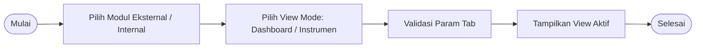
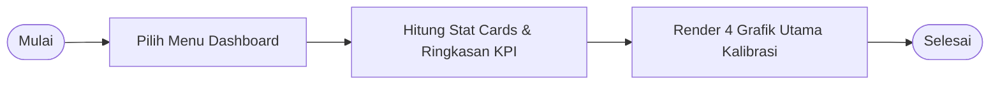
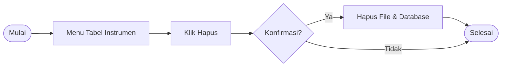
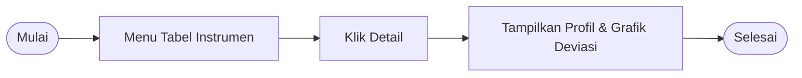
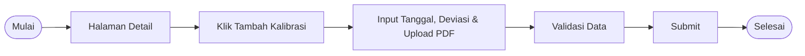
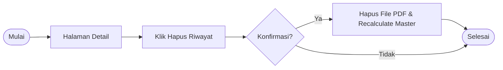
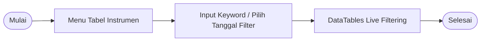

# 📑 BluePrint Teknis: Detail Alur Proses Bisnis (BPM Level List)
**Sistem PMN (Work Schedule) - E-Calibration**
*PT Indonesia Asahan Aluminium (INALUM)*

---

## 📌 Daftar Hirarki Alur Proses Bisnis (9 Level Workflows)

Berikut adalah 9 alur proses bisnis bertingkat yang disusun sesuai format **Inalum Technical Blueprint** dengan diagram alir horizontal (`flowchart LR`) serta rincian tabel proses & deskripsi.

---

### 🔹 Level 1: Manajemen Navigasi & Pemantauan Dashboard

#### 3.1 Alur Navigasi Switch Mode (Eksternal vs Internal)

| Proses | Deskripsi |
| :--- | :--- |
| **User** | |
| Navigasi Switch Mode | - User memilih modul **Eksternal** atau **Internal** dari navbar utama - User memilih opsi tampilan **Dashboard** atau **Instrumen** - Sistem memvalidasi parameter tampilan pada URL - Sistem menampilkan view aktif secara dinamis - Selesai |

---

#### 3.2 Alur Pemantauan Dashboard (Eksternal & Internal)

| Proses | Deskripsi |
| :--- | :--- |
| **User** | |
| Pemantauan Dashboard | - User mengakses menu Dashboard (Eksternal / Internal) - Sistem menghitung 4 Stat Cards Overview (Total, Dikalibrasi, Jatuh Tempo, Rusak) - Sistem merender Kurva Pelaksanaan Tahunan & Grafik Kondisi per Kategori - Sistem merender Pie Chart Populasi & Breakdown Jenis Alat - Selesai |

---

### 🔹 Level 2: Pengelolaan Master Instrumen & Kondisi Alat

#### 3.3 Alur Tambah Data Master Instrumen Baru

| Proses | Deskripsi |
| :--- | :--- |
| **User** | |
| Tambah Master Instrumen | - User memilih menu Tabel Instrumen - User menekan tombol **+ Tambah Data** - User menginput spesifikasi instrumen, memilih kondisi alat, dan upload foto - User melakukan validasi atas data yang diinputkan - User menekan tombol **Submit** untuk menyimpan data - Selesai |

---

#### 3.4 Alur Edit Data Master & Perubahan Kondisi Alat

| Proses | Deskripsi |
| :--- | :--- |
| **User** | |
| Edit Master Instrumen | - User memilih menu Tabel Instrumen - User memilih alat dan menekan ikon **Edit** - User mengubah data spesifikasi atau memperbarui kondisi alat - User melakukan validasi atas data yang diubah - User menekan tombol **Submit** untuk menyimpan perubahan - Selesai |

---

#### 3.5 Alur Hapus Data Master Instrumen

| Proses | Deskripsi |
| :--- | :--- |
| **User** | |
| Hapus Master Instrumen | - User memilih menu Tabel Instrumen - User menekan ikon **Hapus** pada baris instrumen - User mengonfirmasi dialog hapus data - Sistem menghapus file fisik foto/pdf dan record database master - Selesai |

---

### 🔹 Level 3: Pengelolaan Riwayat Kalibrasi & Sertifikat PDF

#### 3.6 Alur Pemantauan Halaman Detail & Grafik Deviasi Alat

| Proses | Deskripsi |
| :--- | :--- |
| **User** | |
| Halaman Detail | - User memilih menu Tabel Instrumen - User menekan ikon **Detail** (mata) pada instrumen - Sistem menampilkan profil alat, foto fisik, dan line chart kurva deviasi - Sistem menampilkan tabel riwayat kalibrasi terurut kronologis - Selesai |

---

#### 3.7 Alur Input Riwayat Kalibrasi Baru & Upload Sertifikat PDF

| Proses | Deskripsi |
| :--- | :--- |
| **User** | |
| Input Riwayat Kalibrasi | - User membuka Halaman Detail instrumen - User menekan tombol **+ Tambah Kalibrasi** - User menginput tanggal kalibrasi, deviasi, dan mengunggah sertifikat PDF - Sistem menghitung tanggal berikutnya secara otomatis - User menekan tombol **Submit** untuk menyimpan riwayat - Selesai |

---

#### 3.8 Alur Hapus Riwayat Kalibrasi Alat

| Proses | Deskripsi |
| :--- | :--- |
| **User** | |
| Hapus Riwayat Kalibrasi | - User membuka Halaman Detail instrumen - User menekan tombol **Hapus** pada baris riwayat kalibrasi - User mengonfirmasi dialog hapus riwayat - Sistem menghapus file PDF dan menghitung ulang tanggal berikutnya master alat - Selesai |

---

### 🔹 Level 4: Filtering Data & Fitur Operasional

#### 3.9 Alur Pencarian Live & Filtering Tanggal Kalibrasi

| Proses | Deskripsi |
| :--- | :--- |
| **User** | |
| Live Search & Filter | - User memilih menu Tabel Instrumen - User memasukkan kata kunci pada kolom **Cari...** atau memilih tanggal filter - Sistem menyaring dan menampilkan data instrumen secara real-time - User dapat menekan tombol **Clear Filter** untuk me-reset tampilan - Selesai |
