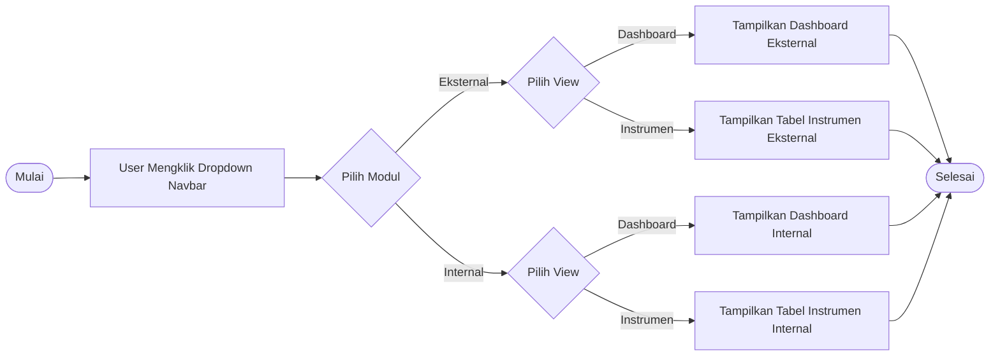
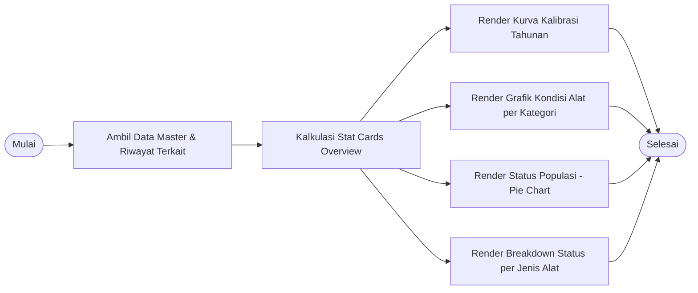
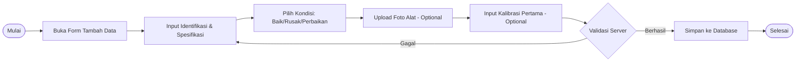
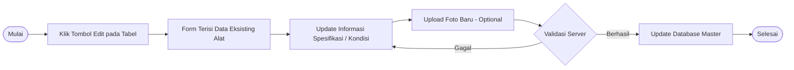
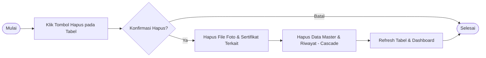
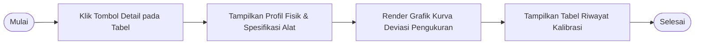
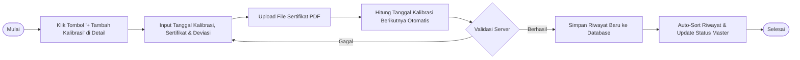
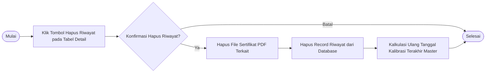

# 📑 BluePrint Teknis: Detail Alur Proses Bisnis (BPM Level List)
**Sistem PMN (Work Schedule) - E-Calibration**
*PT Indonesia Asahan Aluminium (INALUM)*

---

## 📌 Daftar Hirarki Alur Proses Bisnis (9 Level Workflows)

Berikut adalah 9 alur proses bisnis bertingkat yang disusun sesuai format **Inalum Technical Blueprint** dengan diagram alir horizontal (`flowchart LR`) serta rincian tabel proses & deskripsi.

---

### 🔹 Level 1: Manajemen Navigasi & Pemantauan Dashboard

#### 3.1 Alur Navigasi Switch Mode (Eksternal vs Internal)



| Proses | Deskripsi |
| :--- | :--- |
| **Navigasi Modul** | - User memilih modul **Eksternal** atau **Internal** dari dropdown navbar utama.<br>- Sistem mengarahkan user ke halaman modul yang dipilih. |
| **Switch View Mode** | - User memilih opsi **Dashboard** atau **Instrumen** pada menu dropdown.<br>- Sistem mengaktifkan section yang sesuai (`#section-dashboard-view` atau `#section-data-view`) secara instan tanpa reload halaman.<br>- URL query parameter otomatis disesuaikan (`?tab=dashboard` atau `?tab=data`). |
| **Selesai** | Tampilan diperbarui secara dinamis sesuai preferensi pemantauan user. |

---

#### 3.2 Alur Pemantauan Dashboard (Eksternal & Internal)



| Proses | Deskripsi |
| :--- | :--- |
| **Penyatuan Modul** | Alur ini berlaku seragam untuk modul **Eksternal** maupun **Internal**, menyajikan indikator kinerja utama (*KPI*) kalibrasi secara terstruktur. |
| **Kalkulasi Stat Cards** | - **Total Instrumen**: Menghitung seluruh unit instrumen terdaftar pada modul terpilih.<br>- **Dikalibrasi**: Menghitung alat dengan kalibrasi aktif (`tanggal_berikutnya >= hari ini`).<br>- **Jatuh Tempo bulan ini**: Menghitung alat yang jatuh tempo dalam 30 hari ke depan.<br>- **Rusak**: Menghitung total alat dengan kondisi fisik `rusak`. |
| **Kurva Pelaksanaan** | Line chart membandingkan target kalibrasi per bulan dengan realisasi kalibrasi (*Selesai Dikalibrasi*) pada tahun terpilih. |
| **Kondisi per Kategori** | Stacked column chart menampilkan statistik kondisi fisik alat per kategori (`Baik` 🟢, `Rusak` 🔴, `Perbaikan` 🟡). |
| **Status Populasi (Pie)** | Donut chart menampilkan proporsi status kalibrasi alat (`Dikalibrasi` 🟢, `Akan Expired` 🟡, `Tidak Aktif` 🔴). |
| **Breakdown Jenis Alat** | Horizontal stacked bar chart menampilkan distribusi status kalibrasi per jenis/kategori instrumen (`Dikalibrasi`, `Akan Expired`, `Tidak Aktif`). |

---

### 🔹 Level 2: Pengelolaan Master Instrumen & Kondisi Alat

#### 3.3 Alur Tambah Data Master Instrumen Baru (Add New Instrument)



| Proses | Deskripsi |
| :--- | :--- |
| **Buka Form Tambah** | User mengklik tombol `+ Tambah Data` pada halaman list instrumen. |
| **Input Identifikasi & Spesifikasi** | User mengisi Nomor Identifikasi (unik), Nama Instrumen, Seksi Pemakai, Kategori Alat, Interval/Kapasitas, Ketelitian, Model/Tipe, Pembuat, Kegunaan, Periode Kalibrasi (tahun), Tanggal Mulai Digunakan, dan Standar Batas. |
| **Pilih Kondisi Alat** | User memilih kondisi fisik alat menggunakan *Modern Segmented Toggle*: `🟢 Baik`, `🔴 Rusak`, atau `🟡 Perbaikan`. |
| **Upload Foto & Kalibrasi Awal** | User dapat mengunggah file foto alat (`.jpg`/`.png`) dan memasukkan data/sertifikat kalibrasi terakhir jika ada. |
| **Validasi & Simpan** | Sistem memverifikasi keunikan nomor identifikasi. Jika sukses, data tersimpan di database master dan halaman dialihkan kembali ke tabel data. |

---

#### 3.4 Alur Edit Data Master & Perubahan Kondisi Alat (Edit Instrument)



| Proses | Deskripsi |
| :--- | :--- |
| **Buka Form Edit** | User mengklik tombol `Edit` (ikon pensil) pada baris alat yang ingin diubah. |
| **Modifikasi Data & Kondisi**| User memperbarui data spesifikasi atau mengubah kondisi fisik alat (`Baik`, `Rusak`, `Perbaikan`). |
| **Update Foto** | User dapat mengganti foto fisik alat dengan mengunggah foto baru. |
| **Validasi & Simpan** | Sistem menyimpan perubahan ke database master instrumen dan otomatis memperbarui statistik dashboard. |

---

#### 3.5 Alur Hapus Data Master Instrumen (Delete Instrument)



| Proses | Deskripsi |
| :--- | :--- |
| **Trigger Hapus** | User mengklik tombol `Hapus` (ikon tempat sampah) pada baris instrumen. |
| **Konfirmasi User** | Pop-up konfirmasi sistem (*Browser Confirm*) meminta kepastian penghapusan data. |
| **Penghapusan File & Data**| - Jika disetujui, sistem menghapus file fisik foto alat dan file sertifikat PDF dari server storage.<br>- Sistem menghapus record master instrumen di database (secara *CASCADE* menghapus seluruh riwayat terikat). |
| **Pembaruan Tampilan** | Tabel instrumen dan statistik dashboard diperbarui secara otomatis. |

---

### 🔹 Level 3: Pengelolaan Riwayat Kalibrasi & Sertifikat PDF

#### 3.6 Alur Pemantauan Halaman Detail & Grafik Deviasi Alat



| Proses | Deskripsi |
| :--- | :--- |
| **Akses Detail** | User mengklik tombol `Detail` (ikon mata) pada tabel instrumen. |
| **Profil & Foto Alat** | Sistem menampilkan profil lengkap instrumen, spesifikasi teknis, umur alat, kondisi fisik, dan foto fisik instrumen. |
| **Grafik Deviasi** | Line chart interaktif menampilkan riwayat nilai deviasi pengukuran dari setiap pelaksanaan kalibrasi dibandingkan dengan garis batas penerimaan (*tolerance limit*). |
| **Tabel Riwayat** | Menampilkan seluruh riwayat kalibrasi terurut secara kronologis beserta link download sertifikat PDF. |

---

#### 3.7 Alur Input Riwayat Kalibrasi Baru & Upload Sertifikat PDF



| Proses | Deskripsi |
| :--- | :--- |
| **Form Riwayat Baru** | User mengklik tombol `+ Tambah Kalibrasi` pada halaman detail instrumen. |
| **Input Data Kalibrasi** | User menginput tanggal pelaksanaan kalibrasi, nama badan/lembaga penguji, nomor sertifikat, nilai deviasi aktual, dan catatan hasil. |
| **Upload Sertifikat PDF** | User mengunggah dokumen digital sertifikat resmi (`.pdf`). |
| **Kalkulasi Otomatis** | Sistem menghitung `tanggal_berikutnya` secara otomatis (`tanggal_kalibrasi + periode_kalibrasi_tahun`). |
| **Auto-Sort & Update Status**| Sistem menyimpan riwayat baru, mengurutkan seluruh riwayat berdasarkan tanggal kalibrasi terbaru, dan meng-update tanggal sertifikasi berikutnya pada master alat. |

---

#### 3.8 Alur Hapus Riwayat Kalibrasi Alat



| Proses | Deskripsi |
| :--- | :--- |
| **Trigger Hapus Riwayat** | User mengklik tombol `Hapus` pada salah satu baris riwayat kalibrasi di halaman detail. |
| **Penghapusan Sertifikat** | Sistem menghapus file sertifikat PDF terikat dari direktori storage server. |
| **Kalkulasi Ulang Master** | Sistem menghapus record riwayat dan secara otomatis memperbarui `tanggal_terakhir` dan `tanggal_berikutnya` pada master instrumen menggunakan riwayat terbaru yang tersisa. |

---

### 🔹 Level 4: Filtering Data & Fitur Operasional

#### 3.9 Alur Pencarian Live & Filtering Tanggal Kalibrasi

```mermaid
flowchart LR
    A([Mulai]) --> B[User Berada di Tabel Data Instrumen]
    B --> C{Pilih Jenis Filter}
    C -->|Ketik Keyword| D[Input Kata Kunci di Input 'Cari...']
    C -->|Pilih Tanggal| E[Pilih Tanggal pada Input Date Filter]
    C -->|Pilih Page Length| F[Pilih Jumlah Baris (10/15/25/50)]
    D & E & F --> G[DataTables Filtering Engine Update Tampilan Live]
    G --> H{Klik 'Clear Filter'?}
    H -->|Ya| I[Reset Seluruh Input Filter ke Default]
    H -->|Tidak| J([Selesai])
    I --> G
```

| Proses | Deskripsi |
| :--- | :--- |
| **Live Search** | User mengetikkan kata kunci (nama alat, nomor identifikasi, seksi, kategori, dll.) pada kolom `Cari...`. DataTables menyaring baris tabel secara instan (*real-time*). |
| **Date Range Filtering**| User memilih tanggal kalibrasi tertentu pada input tanggal filter. Tabel menyaring dan hanya menampilkan instrumen yang memiliki tanggal kalibrasi sesuai. |
| **Page Length & Reset** | User dapat menyesuaikan jumlah baris yang tampil per halaman (10, 15, 25, 50) serta mengklik `Clear Filter` untuk mengembalikan tabel ke kondisi awal. |
